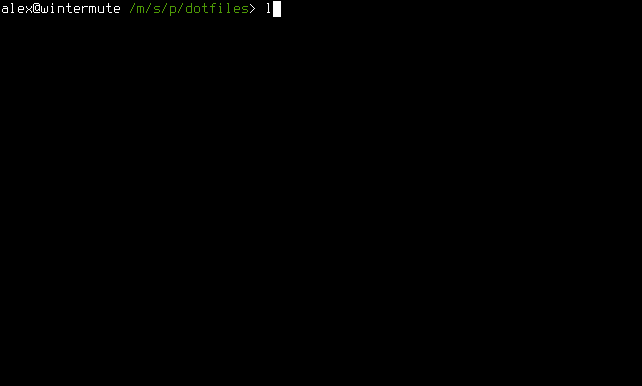

# Homemaker

Homemaker is a lightweight tool for straightforward and efficient management of \*nix configuration files found in the
user's home directory, commonly known as dot-files. It can also be readily used for general purpose system
bootstrapping, including installing packages, cloning repositories, etc. This tool is written in Go, requires no
installation, has no dependencies and makes use of simple configuration file structure inspired by
[make](https://en.wikipedia.org/wiki/Make_%28software%29) to generate symlinks and execute system commands to aid in
configuring a new system for use.



## Table of Contents

*   [Motivation](#motivation)
*   [Installation](#installation)
*   [Configuration](#configuration)
    *   [Environment Variables](#environment-variables)
    *   [Command Macros](#command-macros)
    *   [Task and Macro Variants](#task-and-macro-variants)
    *   [Conditional Execution](#conditional-execution)
*   [Usage](#usage)
*   [Sample](#sample)

## Motivation

Ever since switching to using Linux as my daily driver operating system, I have been searching for a way to effectively
manage settings between different computers (and system reinstalls on the same machine) while avoiding the accumulation
of cruft that plagues our home directories.

Specifically, I required a solution that had the following characteristics:

*   **Do not require software installation**

    The user may not have root privileges on all the computers that she accesses, making it difficult to make use
    software that has additional dependencies. Even if the user has root on the machine in question, it is sub-optimal
    to require her to install software packages just to bootstrap the system.

*   **Support configuration variants**

    The user should be able to use cherry-pick which settings they wish to use. Different system installs have different
    configuration requirements; it must be possible to share common settings while keeping the unique bits unique to
    each machine. Furthermore, it should be possible to store all configuration settings in one location.

*   **Make no assumptions about synchronization**

    While Git often works well for managing dot-files, it is not ideal for every situation. I've seen some applications
    add and remove seemingly randomly-named files within their configuration directories, while others store their
    settings in large, opaque binary blobs. Managing configuration settings for such poorly-behaved applications may be
    easier through, [Dropbox](https://www.dropbox.com/), [rsync](https://en.wikipedia.org/wiki/Rsync), or some other
    utility outside of version control.

*   **Be easy to read and modify the source**

    As a programmer, I always consider the underlying technology of a tool when deciding whether or not to use it. The
    user should feel empowered to change and test the application without having to deal with the archaic incantations
    otherwise known as shell scripts. Scripting languages can work well but are closely tied to the environment in which
    they are executed.

It soon became apparent to me that utility which met all of my requirements for simply did not exist. After making do
with a hastily hacked-together Python script for a couple of months, I decided that this problem deserved a clean,
formal solution. I settled on building this new utility in Go because in addition to the language syntax being clear and
easy to understand, executables built by the Go compiler are statically linked, making them highly portable. Just drop
the binary on your system and you are ready! The result of my work is Homemaker; I hope that you find it suitable for
your needs.

## Installation

If you already have the Go environment and toolchain set up, you can get the latest version by running:

```
$ go install foosoft.net/projects/homemaker@latest
```

Otherwise, you can use the [pre-built binaries](https://github.com/FooSoft/homemaker/releases) from the project page.

## Configuration

Configuration files for Homemaker can be authored in your choice of [TOML](https://github.com/toml-lang/toml),
[JSON](http://json.org/), or [YAML](http://yaml.org/)  markup languages. Being the easiest to read out of the three,
TOML will be used for the example configuration files. Worry not if you are unfamiliar with this format; everything you
need to know about it will be shown below.

Let's start by looking at a basic example configuration file, `example.toml`. Notice that Homemaker determines which
markdown language processor to use based on the extension of your c:nfiguration file. Use `.toml/.tml` for TOML,
`.yaml/.yml` for YAML, and `.json` for JSON. Be aware that specifying an incorrect file extension will prevent your
configuration file from being parsed correctly.

```toml
[tasks.default]
    links = [
        [".config/fish"],
        [".config/keepassx"],
        [".config/terminal"],
        [".config/vlc"],
        [".gitconfig"],
        [".xinputrc"],
    ]
```

We could have just as easily written this configuration in JSON (or YAML for that matter), but it's subjectively uglier:

```json
{
    "tasks": {
        "default": {
            "links": [
                [".config/fish"],
                [".config/keepassx"],
                [".config/terminal"],
                [".config/vlc"],
                [".gitconfig"],
                [".xinputrc"]
            ]
        }
    }
}
```

To create symlinks based on the contents of the TOML file from before, we invoke the `homemaker` utility as follows:

```
$ homemaker example.toml /mnt/data/config
```

To get a better idea of what `/mnt/data/config` is, let's look at the in-program documentation:

```
Usage: homemaker [options] conf src
https://foosoft.net/projects/homemaker/

Parameters:
  -clobber
        delete files and directories at target
  -dest string
        target directory for tasks (default "/home/alex")
  -force
        create parent directories to target (default true)
  -nocmds
        don't execute commands
  -nolinks
        don't create links
  -task string
        name of task to execute (default "default")
  -unlink
        remove existing links instead of creating them
  -variant string
        execution variant for tasks and macros
  -verbose
        verbose output
```

For the purpose of our illustration, `src` is defined on the command line to be `/mnt/data/config`; namely the source
directory where your dot-files live (this will be your Git repository, Dropbox folder, rsync root, etc.). The symlinks
that Homemaker creates will point to the configuration files in this directory. You may have noticed that you can also
provide a destination directory via the `-dest` command line argument; this is where the symlinks should be created and
it defaults to your home directory.

Another useful parameter is `task`; it will be initialized to the value `default` unless you override it on the command
line. In practice, this means that Homemaker will try to find a task called `default` and execute it. You can create as
many unique tasks as necessary to correspond to your configuration requirements, and then choose which one will execute
by specifying it on the command line in the format `-task=taskname`. Good candidates for tasks are computer names, as
shown in the configuration file below:

```toml
[tasks.flatline]
    links = [
        [".config/syncthing", ".config/syncthing_flatline"],
        [".s3cfg"],
        [".sabnzbd"],
        [".ssh", ".ssh_flatline"],
    ]

[tasks.wintermute]
    links = [
        [".config/syncthing", ".config/syncthing_wintermute"],
        [".ssh", ".ssh_wintermute"],
    ]
```

Here we see two tasks, named after the computers that will be using them, `flatline` and `wintermute`. Certain
configuration data like key pairs and other per-machine settings should only be linked on the computer that is using
them. That is to say if `flatline` and `wintermute` both try to manage the `.ssh` directory, a conflict will occur at
both the source and destination directories. We can easily resolve the source directory conflict by giving the `.ssh`
directories unique names, such as `.ssh_flatline` and `.ssh_wintermute`. The conflict at the destination directory can
be fixed as shown above; we will create per-machine tasks that will symlink only the needed directory.

You may have noticed that each entry in the `links` collection is an array, which up until now has contained only one
item. A second item can be added if the source file or directory name is different from that in the destination. If the
paths provided are relative they will be assumed to be relative to the destination and source directories respectively.

Now that we have machine specific tasks defined in our configuration file, it would be nice to still be able to share
configuration settings that are common to the two computers. We can do this by adding a `dep` array to our tasks as
shown below:

```toml
[tasks.common]
    links = [
        [".config/fish"],
        [".config/keepassx"],
        [".config/terminal"],
        [".config/vlc"],
        [".gitconfig"],
        [".xinputrc"],
    ]

[tasks.flatline]
    deps = ["common"]
    links = [
        [".config/syncthing", ".config/syncthing_flatline"],
        [".s3cfg"],
        [".sabnzbd"],
        [".ssh", ".ssh_flatline"],
    ]

[tasks.wintermute]
    deps = ["common"]
    links = [
        [".config/syncthing", ".config/syncthing_wintermute"],
        [".ssh", ".ssh_wintermute"],
    ]
```

Homemaker will process the dependency tasks before processing the task itself.

Sometimes, just linking a config file is not enough, because the content of the configuration file needs to be adapted
to the target and we do not want to maintain several different versions of the same file. For such use cases, Homemaker
supports templates. The configuration syntax for templates is the same as for links.

```toml
[tasks.template]
    templates = [
        [".gitconfig"]
    ]
```

In the template file, the [go templating syntax](https://godoc.org/text/template) is used for the customization of the
configuration file. With the `.Env` prefix, all environment variables are available. Template example:

```
[user]
name = "John Doe"
{{if eq .Env.USER "john"}}
    email = "john@doe.me"
{{else}}
    email = "john.doe@work.com"
{{end}}
```

In addition to creating links and processing templates, Homemaker is capable of executing commands on a per-task basis.
Commands should be defined in an array called `cmds`, split into an item per each command line argument. All of the commands
are executed with `dest` as the working directory (as mentioned previously, this defaults to your home directory). If any
command returns a nonzero exit code, Homemaker will display an error message and prompt the user to determine if it should
*abort*, *retry*, or *cancel*. Additionally, if you must have explicit control of whether commands execute before or
after the linking phase, you can use the `cmdspre` and `cmdspost` arrays which have similar behavior.

The example task below will clone and install configuration files for Vim into the `~/.config` directory, and create
links to it from the home directory. You may notice that this task references an environment variable (set by Homemaker
itself) in the `links` block; you can read more about how to use environment variables in the following section.

```toml
[tasks.vim]
    cmds = [
        ["rm", "-rf", ".config/vim"],
        ["git", "clone", "https://github.com/FooSoft/dotvim", ".config/vim"],
    ]
    links = [
        [".vimrc", "${HM_DEST}/.config/vim/.vimrc"],
        [".vim", "${HM_DEST}/.config/vim/.vim"],
    ]
```

### Environment Variables

Homemaker supports the expansion of environment variables for both command and link blocks as well as for dependencies.
This is a good way of avoiding having to hard code absolute paths into your configuration file. To reference an
environment variable simply use `${ENVVAR}` or `$ENVVAR`, where `ENVVAR` is the variable name (notice the similarity
to normal shell variable expansion). In addition to being able to reference all of the environment variables defined
on your system, Homemaker defines a couple of extra ones for ease of use:

*   `HM_CONFIG`

    Path to the homemaker configuration file.

*   `HM_TASK`

    Task name invoked from the command line.

*   `HM_SRC`

    Source directory for link creation.

*   `HM_DEST`

    Destination directory for link creation.

*   `HM_VARIANT`

    Variant used for task and macro execution.

Environment variables can also be set within tasks block by assigning them to the `envs` variable. The example below
demonstrates the setting and clearing of environment variables:

```toml
[tasks.default]
    envs = [
        ["MYENV1", "foo"],        # set MYENV1 to foo
        ["MYENV2", "foo", "bar"], # set MYENV2 to foo,bar
        ["MYENV3"],               # clear MYENV3
    ]
```

It should be pointed out that it is possible to reference other environment variables using the syntax shown in the
first part of this section. This makes it possible to expand variables like `PATH` without overwriting their existing
value.

### Command Macros

It is often convenient to execute certain commands repeatedly within task blocks to install packages, clone git
repositories, etc. Homemaker provides macro blocks for this purpose; you can specify a command *prefix* and *suffix*
that is used to wrap the parameters you provide. For example, you can declare a macro for `apt-get install` and with the
declaration shown below (much like tasks, macro declarations are global).

```toml
[macros.install]
    prefix = ["sudo", "apt-get", "install", "-y"]
```

Macros can be referenced from commands by prefixing the macro name with the `@` symbol (it must be the first character
of the first item of a command). For example, the task below installs several python packages using the macro above:

```toml
[tasks.python]
    cmds = [
        ["@install", "python-dev", "python-pip", "python3-pip"]
    ]
```

Macros can have dependencies just like tasks. The `git clone` macro below makes sure that git is installed before
attempting to clone a repository with it.

```toml
[macros.clone]
    deps = ["git"]
    prefix = ["git", "clone"]

[tasks.git]
    cmds = [
        ["@install", "git"]
    ]
```

Macros help reduce the clutter that comes from the repeated commands which must be executed to bootstrap a new system.
When executed with the `verbose` option, Homemaker will echo the expanded macro commands before executing them.

### Task and Macro Variants

If you wish to use this tool in a truly cross-platform and cross-distribution manner without authoring multiple
configuration files, you will have to provide information to Homemaker about the environment it is running in. Different
operating systems and distributions use different package managers and package names; we solve this problem with task
and macro *variants*.

For example, if you want to write a generic macro for installing packages that works on both Ubuntu and Arch Linux, you
can define the following variants (Ubuntu uses the *apt* package manager and Arch Linux uses *pacman*).

```toml
[macros.install__ubuntu]
    prefix = ["sudo", "apt-get", "install"]

[macros.install__arch]
    prefix = ["sudo", "pacman", "-S"]
```

The double underscore characters signify that the following identifier is a *variant decorator*. In most cases, you only
have to think about variants when you are writing task and macro definitions, not when using them. For example, to see
how to use the `install` macro that we just created, examine the configuration below:

```toml
[tasks.tmux]
    cmds = [["@install", "tmux"]]
```

Notice that the package manager is conveniently abstracted by the `install` macro. Be aware that for this example to
work properly, you must specify a variant on the command line as shown below. Failing to specify a variant will cause
Homemaker try to look for an undecorated `install` macro (which doesn't exist), leading to failure.

```
$ homemaker --variant=ubuntu example.toml /mnt/data/config
```

Tasks can be be decorated much like commands:

```toml
[tasks.vim__server]
    cmds = [["@install", "vim-nox"]]

[tasks.vim]
    cmds = [["@install", "gvim"]]
```

In the above example, we avoid installing `gvim` on the server variant, where the X windowing system is not installed or
needed. Homemaker only executes the best task or macro candidate; if the provided variant does not match any tasks or
macros, the base undecorated version will be used instead if it is available.

The command below will execute the `vim__server` task:
```
$ homemaker --variant=server example.toml /mnt/data/config
```

Both of the commands below will execute the `vim` task:
```
$ homemaker --variant=foobar example.toml /mnt/data/config
$ homemaker example.toml /mnt/data/config
```

If for some reason you wish to explicitly reference the base task from the decorated task, you can add a dependency that
contains a *variant override* as shown in the somewhat contrived examples below:

```toml
[tasks.foo]
[tasks.foo__specific]
    deps = ["foo__"]         # executes foo and foo_specific

[tasks.bar__specific]
[tasks.bar]
    deps = ["bar__specific"] # executes bar_specific and bar
```

Although variants are somewhat of an advanced topic as far as Homemaker features are concerned, they can be used to
provide some basic conditional functionality to your configuration file without significantly increasing complexity for
the user.

### Conditional Execution

Homemaker provides a facility for determining whether or not a given task should execute at runtime; this is
accomplished with the `accepts` and `rejects` task variables. Both follow the same syntax as the `cmds` variable and
support macro and environment variable expansion.

*   **accepts**

    Execute commands non-interactively; any non-zero return code will cause the task to be skipped.

*   **rejects**

    Execute commands non-interactively; any return code of zero code will cause the task to be skipped.

The intent of this feature is to allow tasks to "early out" when the work they carry out has already been completed. In
the example below, we use the `which` command to see if [fish shell](https://fishshell.com/) is already installed before
trying to install it. This is possible because `which` returns a non-zero value when it encounters strings which do not
correspond to applications installed on the current system.

```toml
[tasks.fish]
    rejects = [["which", "fish"]]
    cmds = [["@install", "fish"], ["chsh", "-s", "/usr/bin/fish"]]
    links = [[".config/fish/config.fish"]]
```

The `accepts` variable is the logical opposite of `rejects` and can be used to conditionally execute tasks only when all
of the specified commands exit out with a return code of zero.

## Usage

Executing Homemaker with the `-help` command line argument will trigger online help to be displayed. The list below
provides a more detailed description of what the parameters do.

*   **clobber**

    By default, Homemaker will only remove identically-named symlinks at the destination directory. Using this parameter
    will cause Homemaker to be more aggressive and delete clashing files and entire directories as well. This can be
    useful for getting rid of the default configuration settings some applications write when you run them for the first
    time, but should obviously be used with caution.

*   **dest**

    This parameter specifies destination where Homemaker is to create symlinks. This will default to the home directory
    for the current user, and as long as you are just using this application to manage dot-files, will probably never
    need to be changed.

*   **force**

    Sometimes dot-files for an application are nested within parent directories that must exist in order to allow the
    symlink to be successfully created (for example the `.config` directory in `.config/vlc`). As this is the expected
    behavior, this parameter defaults to `true`; however you can explicitly disable it if required. You can specify the
    access permissions of directories created by force by providing a third array item in the link descriptor. For
    example, if you wanted the `.ssh` directory to be created with mode `700`, you could write the following:
    `[".ssh/id_rsa.pub", ".ssh_flatline/id_rsa.pub", "0700"]`. Notice that you can specify permissions in octal notation
    by adding a leading zero value (the `0x` prefix signifies hexadecimal).

*   **nocmds**

    Do not execute commands for the `cmds` blocks inside of tasks.

*   **nolinks**

    Do not create links for the `links` blocks inside of tasks.

*   **task**

    This parameter is used to specify which task Homemaker will process when executed. It defaults to the `default`
    task, which should be used when creating a configuration file that does not have system-specific tasks specified.

*   **unlink**

    Sometimes it's useful to "uninstall" links previously created by Homemaker. When running with the `unlink` flag, the
    tool will delete the links created by the tasks provided. This flag automatically sets the `nocmds` flag as well,
    because it makes no sense to execute commands when performing an uninstall operation.

*   **variant**

    When using homemaker across different operating systems or distributions it can be useful to be able to perform
    conditional command and task execution, allowing for variation in things like package names and package management
    tools. This parameter is used for specifying the name of the variant that should be used.

*   **verbose**

    When something isn't going the way you expect, you can use this parameter to make Homemaker to log everything it is
    doing to console.

## Sample

Below is a sample configuration file which should help to illustrate how Homemaker can be used in practice.

```toml
#
# macros
#

[macros.clone]
    deps = ["git"]
    prefix = ["git", "clone"]

[macros.install]
    prefix = ["sudo", "dnf", "install", "-y"]

#
# development
#

[tasks.dev]
    deps = ["git", "vim", "node", "python", "golang"]
    cmds = [[
        "@install",
        "make",
        "automake",
        "gcc",
        "gcc-c++",
        "cmake",
        "the_silver_searcher",
        "meld",
        "ncurses-compat-libs",
    ]]

[tasks.git]
    cmds = [["@install", "git"]]
    links = [[".gitconfig"]]

[tasks.golang]
    envs = [["GOPATH", "${HM_DEST}/projects/go"]]
    cmds = [["mkdir", "-p", "$GOPATH"], ["@install", "golang"]]

[tasks.node]
    cmds = [["@install", "nodejs", "npm"]]

[tasks.python]
    cmds = [["@install", "python-devel", "python-pip"]]

[tasks.vim]
    deps = ["vimrc"]
    cmds = [["@install", "vim-X11", "vim-enhanced"]]

[tasks.vimrc]
    rejects = [["test", "-d", ".config/vim"]]
    cmds = [["@clone", "https://github.com/FooSoft/dotvim.git", ".config/vim"]]
    links = [
        [".vim", "$HM_DEST/.config/vim/.vim"],
        [".vimrc", "$HM_DEST/.config/vim/.vimrc"],
        [".eslintrc.json"],
    ]

#
# general
#

[tasks.fusion]
    cmds = [["/home/alex/projects/dotfiles/bin/fusion.sh"]]

[tasks.virtualbox]
    cmds = [["@install", "VirtualBox"]]

[tasks.nvidia]
    deps = ["fusion"]
    cmds = [["@install", "akmod-nvidia"]]

[tasks.vlc]
    deps = ["fusion"]
    cmds = [["@install", "vlc"]]

[tasks.dropbox]
    deps = ["fusion"]
    cmds = [["@install", "dropbox"]]

[tasks.fish]
    rejects = [["which", "fish"]]
    cmds = [["@install", "fish"], ["chsh", "-s", "/usr/bin/fish"]]
    links = [[".config/fish/config.fish"]]

[tasks.common_term]
    cmds = [["@install", "openssh-server", "fzf", "htop", "p7zip", "unrar", "tmux", "whois", "rsync"]]
    links = [["bin"]]

[tasks.ibus]
    cmds = [["@install", "ibus", "ibus-anthy", "ibus-qt"]]

[tasks.default]
    deps = ["fusion", "common_term", "ibus", "vlc", "dropbox", "dev"]
    cmds = [["@install", "gimp", "keepassxc", "speedcrunch"]]
    links = [[".profile"]]
```
